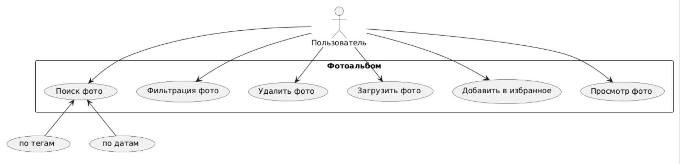
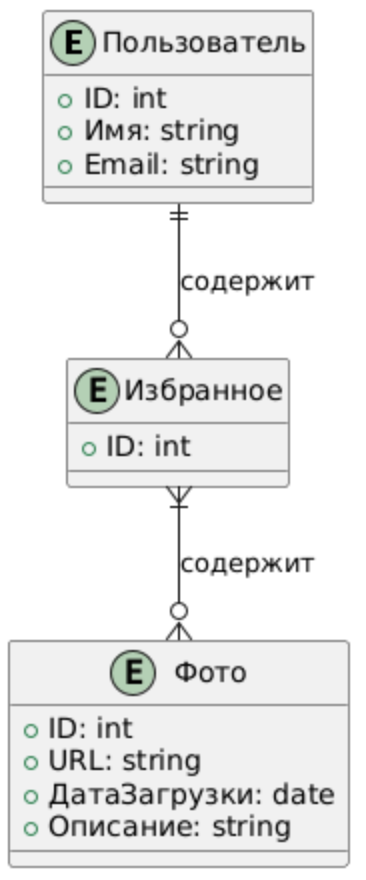
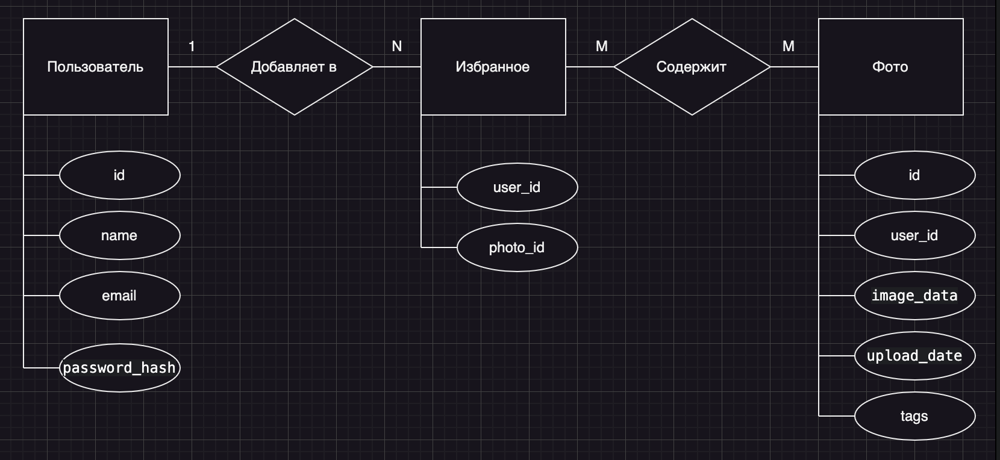

# Фотоальбом

## Описание проекта
Фотоальбом — это веб-приложение, которое позволяет пользователям загружать, просматривать и управлять своими фотографиями с возможностью добавления изображений в избранное. Пользователи могут легко находить свои любимые фотографии и организовывать их в удобном интерфейсе. Этот проект нацелен на создание интуитивно понятного инструмента для хранения и демонстрации визуальных воспоминаний.

## Описание предметной области
Фотоальбомы имеют долгую историю, начиная с физических альбомов и переходя к цифровым форматам. В современном мире пользователи ожидают возможности легко управлять своими фотографиями, быстро находить нужные изображения и делиться ими с друзьями. Приложения для фотоальбомов стали неотъемлемой частью повседневной жизни, предоставляя пользователям удобный способ хранения и организации их визуальных воспоминаний.

## Анализ аналогичных решений

| Критерий                   | Google Photos    | Flickr           | Instagram       |
|----------------------------|------------------|------------------|------------------|
| Удобство интерфейса        | Высокое          | Среднее          | Высокое          |
| Поддержка форматов         | JPEG, PNG, GIF   | JPEG, PNG        | JPEG, PNG        |
| Возможности редактирования | Расширенные      | Основные         | Основные         |

## Функциональные требования
Приложение должно обеспечивать пользователям возможность:
- Загружать фотографии в различных форматах (JPEG, PNG, GIF).
- Просматривать загруженные изображения в виде галереи.
- Добавлять фотографии в избранное.
- Удалять фотографии из альбома.
- Фильтровать и искать фотографии по тегам или датам.

## Use-Case диаграмма

## ER-диаграмма сущностей

- Нотация Чена

## Пользовательские сценарии
1. **Загрузка фотографии**
   - Пользователь заходит на главную страницу.
   - Нажимает на кнопку «Загрузить фото».
   - Выбирает файл изображения на своем устройстве.
   - Нажимает «Подтвердить» для загрузки.
   - Приложение отображает сообщение об успешной загрузке.

2. **Добавление в избранное**
   - Пользователь просматривает список загруженных фотографий.
   - Нажимает на иконку «Добавить в избранное» рядом с выбранным фото.
   - Получает уведомление о успешном добавлении в избранное.
   - Фото теперь отображается на странице «Избранное».

3. **Просмотр избранных фотографий**
   - Пользователь заходит на страницу «Избранное».
   - Просматривает список всех добавленных в избранное фотографий.
   - Нажимает на любое фото для его детального просмотра.
   - Пользователь может удалить фото из избранного.

## Экраны будущего web-приложения

### Экран 1: Главная страница
- Заголовок приложения и кнопка «Загрузить фото».
- Галерея с миниатюрами загруженных фотографий.
- Иконка «Избранное» для быстрого доступа к любимым фотографиям.
- Поле поиска для фильтрации фотографий.

### Экран 2: Избранное
- Заголовок «Избранное».
- Список всех избранных фотографий с миниатюрами.
- Кнопка «На главную».
- Иконка для удаления фотографий из избранного.

### Эскизы интерфейса
 